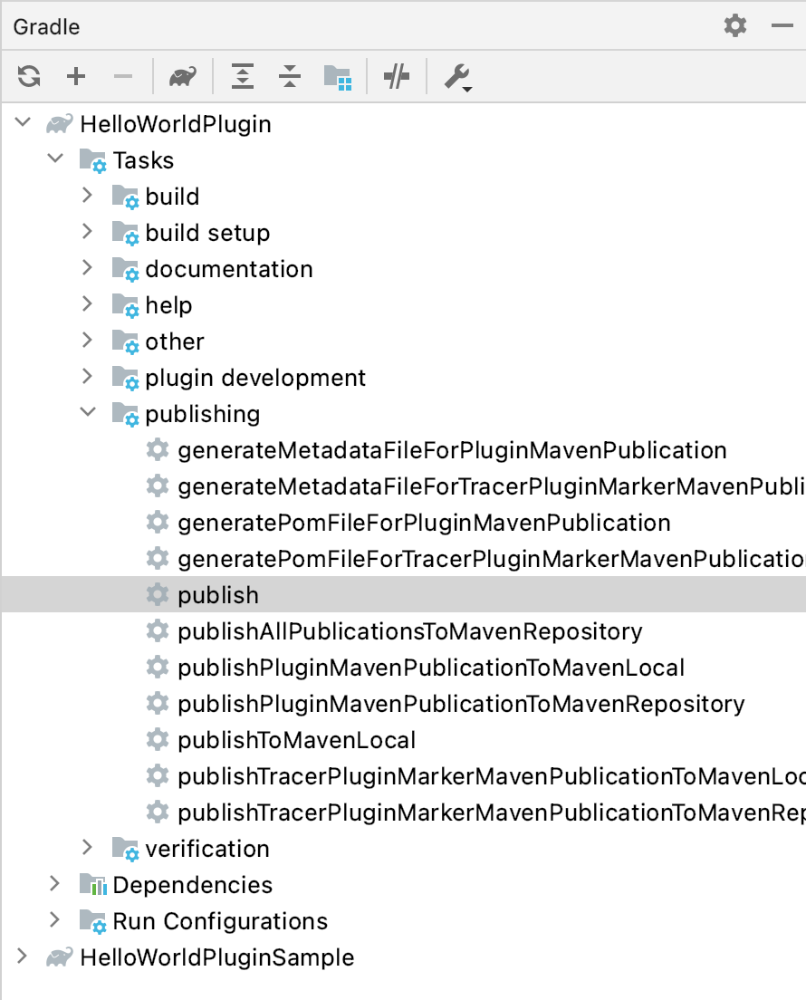
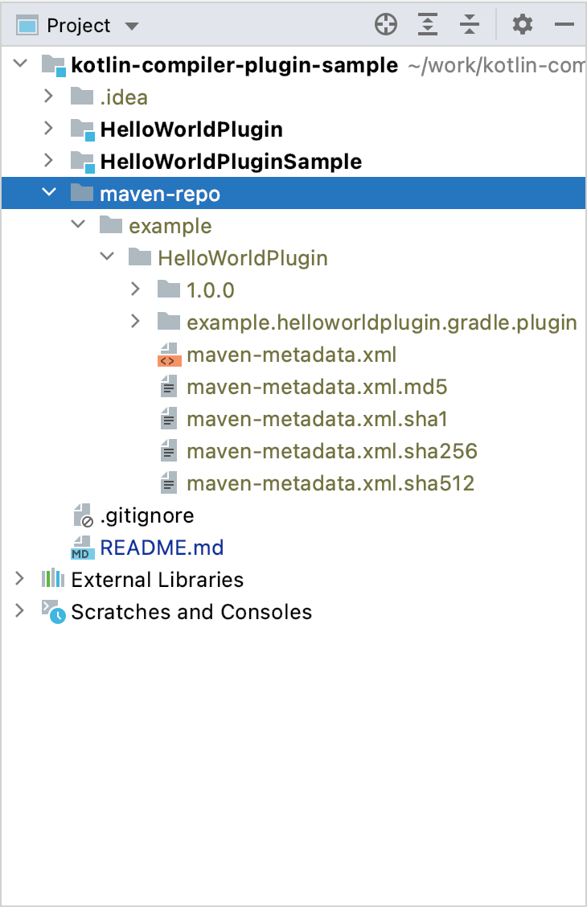
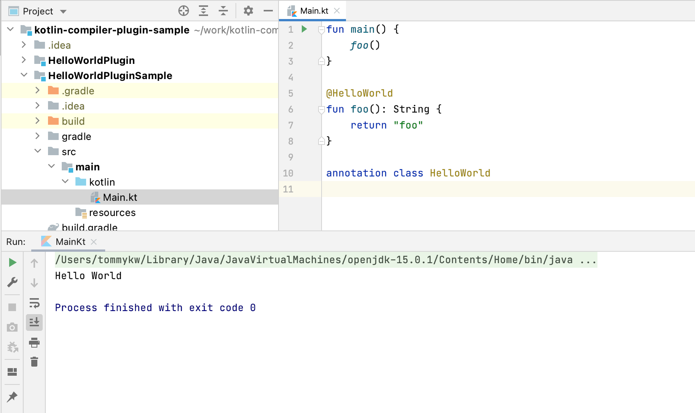
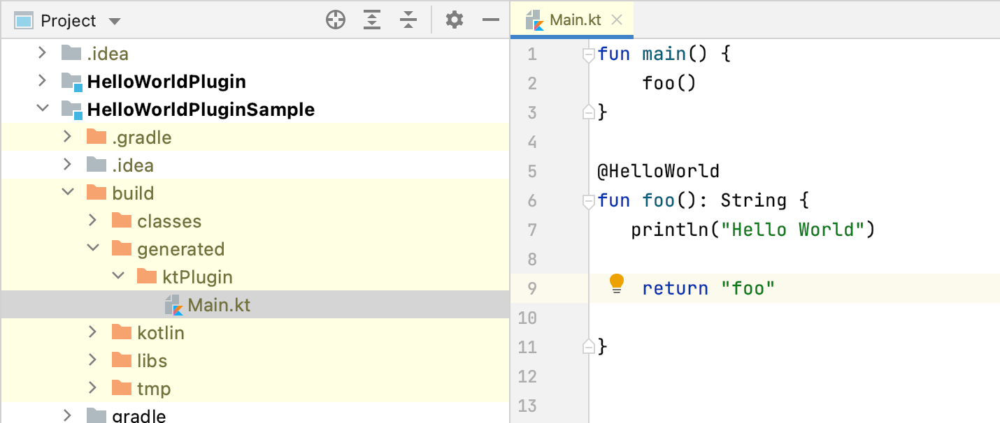

# Kotlin Compiler Plugin Sample

## Summary
This is a sample project using the kotlin compiler plugin. I used the [Tracer-Kotlin-Compiler-Plugin](https://github.com/acejingbo/Tracer-Kotlin-Compiler-Plugin) project as a reference. It consists of the following two projects. 

- HelloWorldPlugin
  - HelloWorldCompilerPlugin.kt
  - HelloWorldGradlePlugin.kt
  - HelloWorldTreeVisitor.kt
- HelloWorldPluginSample
  - Main.kt
    
## Usage
First, run the publish task of HelloWorldPlugin. 
 

A `maven-repo` will be generated in the root directory. 
 

Next, Running the Main.kt of HelloWorldPluginSample will output `Hello World`. 

The files generated by HelloWorldPlugin are located under `HelloWorldPluginSample/build/generated/ktPlugin/`.
You can see that `println("Hello World")` has been added to `foo()` in the generated Main.kt. 

